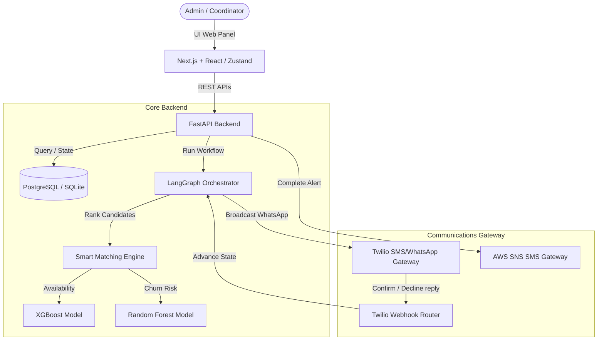
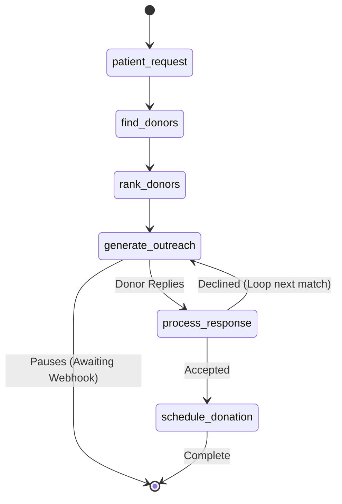

# Blood Warriors AI - Technical System Specification & Architecture

## 1. Executive Summary
**Blood Warriors AI** is an autonomous care coordination and predictive analytics platform built to support Thalassemia Major patients. Thalassemia Major is a preventable genetic blood disorder requiring lifelong, regular blood transfusions every 15 to 21 days. Coordinating regular blood donation cycles manually causes high coordinator burnout, donor fatigue, and scheduling conflicts.

This system resolves these bottlenecks by combining **ensemble machine learning models**, **stateful agent graphs**, and **interactive two-way communication channels** into a closed-loop platform that automates donor matching, schedules outreach broadcasts, and tracks screening prevention campaigns.

---

## 2. High-Level System Architecture



---

## 3. Database Schema

The database is built on SQLAlchemy and structured as follows:

### 3.1. `donors`
Tracks donor demographic and medical eligibility data:
- `id` (String, PK): Unique donor identifier.
- `name` (String): Full name.
- `phone` / `email` (String): Normalized contact details.
- `blood_group` (String): Blood group (e.g., O+, A-, etc.).
- `city` / `latitude` / `longitude` (Float): Geolocation coordinates for proximity calculations.
- `donations_till_date` (Integer): Total successful donations.
- `last_donation_date` (String): Last donation date (`dd-mm-yyyy`).
- `next_eligible_date` (String): Earliest next eligible donation date (`dd-mm-yyyy`, `last_donation_date + 90 days`).
- `engagement_score` (Float): Historical response score (0–100).
- `availability_score` (Float): XGBoost-predicted availability probability (0.0–1.0).
- `churn_risk` (Float): Random Forest-predicted drop-off risk (0.0–1.0).
- `active_status` (String): `"Active"` or `"Inactive"`.
- `consent_given` (Boolean): Flag for opt-in communication.

### 3.2. `patients`
Tracks transfusion requirements:
- `id` (String, PK): Unique patient identifier.
- `name` (String): Full name.
- `blood_group` (String): Needed blood group.
- `quantity_required` (Float): Units needed per cycle.
- `last_transfusion_date` (String): Last transfusion date.
- `expected_next_transfusion_date` (String): Next expected transfusion date.
- `risk_level` (String): `"LOW"`, `"MEDIUM"`, or `"HIGH"`.

### 3.3. `donor_patient_matches` (Care Bridges)
Maps dedicated donor pools to specific patients:
- `id` (Integer, PK): Unique record index.
- `patient_id` (String, FK): Linked patient.
- `donor_id` (String, FK): Linked donor.
- `match_score` (Float): Matching coefficient.
- `relationship_type` (String): `"Bridge"` (dedicated pool) or `"Emergency"`.

### 3.4. `donation_history`
Maintains donation records:
- `id` (Integer, PK): Donation record identifier.
- `donor_id` (String, FK): Associated donor.
- `patient_id` (String, FK): Associated patient.
- `donation_date` (String): Scheduled date.
- `status` (String): `"Scheduled"`, `"Completed"`, or `"Cancelled"`.

---

## 4. Machine Learning & Predictive Modeling

The platform deploys two specialized machine learning models to optimize scheduling:

### 4.1. Availability Model (XGBoost Classifier)
- **Objective:** Predicts the probability of a donor accepting an outreach request at a specific time.
- **Features Used:**
  - `days_since_last_donation`
  - `donations_till_date`
  - `engagement_score`
  - `active_status`
- **Output:** Probability value $P(\text{availability}) \in [0.0, 1.0]$.
- **Usage:** Incorporated into the matching engine calculation to avoid contacting unresponsive donors.

### 4.2. Churn Risk Model (Random Forest Classifier)
- **Objective:** Evaluates the probability of a donor dropping out or becoming inactive.
- **Features Used:**
  - `engagement_score`
  - `days_since_last_donation`
  - `active_status`
  - `response_rate` (ratio of acceptances to total outreach notifications)
- **Output:** Churn probability $P(\text{churn}) \in [0.0, 1.0]$.
- **Usage:** Identifies high-risk donors on the dashboard for preemptive retention interventions.

---

## 5. Stateful Care Orchestration (LangGraph)

Transfusion coordination processes are stateful and asynchronous. The workflow is modeled as a **StateGraph** containing 6 key nodes:



- **`patient_request`:** Validates patient records and transfusion quantities.
- **`find_donors`:** Fetches active database donors compatible with the patient's blood group.
- **`rank_donors`:** Computes match scores using the Smart Matching Engine.
- **`generate_outreach`:** Dispatches communication broadcasts to the top candidates via Twilio and pauses graph execution.
- **`process_response`:** Resumes execution upon Twilio webhook callback. Parses responses. If a donor declines, the engine reduces their engagement score, recalculates churn, and loops back to contact the next candidate.
- **`schedule_donation`:** Schedules the donation record in `"Scheduled"` status.

---

## 6. Proximity Calculations & Proximity Math

Matches are sorted dynamically. The match score is computed as a composite index:

$$\text{Match Score} = (C \times 0.40) + (E \times 0.20) + (A \times 0.20) + (Eng \times 0.10) + (D \times 0.10)$$

Where:
- $C$ (Compatibility Score) = $1.0$ if compatible, else $0.0$.
- $E$ (Eligibility Score) = $1.0$ if eligible at transfusion date, else $0.0$.
- $A$ (Availability Score) = XGBoost predicted probability.
- $Eng$ (Engagement Score) = Normalized historical response score.
- $D$ (Proximity Score) = Normalized distance using the **Haversine formula**:

$$d = 2R \arcsin\left(\sqrt{\sin^2\left(\frac{\Delta\phi}{2}\right) + \cos(\phi_1)\cos(\phi_2)\sin^2\left(\frac{\Delta\lambda}{2}\right)}\right)$$

- **Dedicated Bridge Boost:** If the donor is mapped as a Care Bridge for the patient, their match score receives a $+0.05$ boost to prioritize them over emergency general pools.

---

## 7. Interactive Two-Way Webhook Gateway

1. **Outbound Notification:** Twilio sends a structured SMS/WhatsApp broadcast to the donor's normalized phone number.
2. **Inbound Reply Router:** When the donor replies, Twilio triggers the `/api/v1/notifications/twilio-webhook` route on the FastAPI backend.
3. **Matching & State Resume:** The router cleans the sender's phone number, looks up the corresponding active donor record, locates the active workflow session, and calls:
   ```python
   TransfusionOrchestrator.submit_response(matching_wf_id, "Accepted")
   ```
   Advancing the LangGraph session.

---

## 8. Safety Deferral & Completion Workflows

- **Lockout Deferral:** When a donation is scheduled, the donor's next eligibility date is **not** locked. This prevents locking a donor out in error if there is a no-show or a cancelled appointment.
- **Completion Hook:** The coordinator manually updates the appointment when the donation is successful by posting to `/complete-donation`.
- **Completion Side Effects:**
  - Status updates to `"Completed"`.
  - Donor is locked for **90 days** (`last_donation_date` = today, `next_eligible_date` = today + 90).
  - Availability and churn risk predictions are re-run (donor's availability score drops, rotating them out of matches).
  - A thank-you SMS is sent via **AWS SNS**.

---

## 9. Deployment Topology

The platform is deployed using containerized microservices on **AWS EC2**:

```
+-------------------------------------------------------+
|                      AWS EC2                          |
|  +-------------------+       +---------------------+  |
|  |   Next.js App     |       |    FastAPI App      |  |
|  |   (Port 3000)     | <---> |    (Port 8000)      |  |
|  +-------------------+       +----------+----------+  |
|                                         |             |
|                                         v             |
|                              +----------+----------+  |
|                              |      PostgreSQL     |  |
|                              |     (Port 5432)     |  |
|                              +---------------------+  |
+-------------------------------------------------------+
```

Access policies to external AWS serverless resources (AWS SNS and AWS Bedrock APIs) are managed securely via an **IAM Instance Profile Role** attached directly to the host instance, eliminating the risk of exposed API keys.
