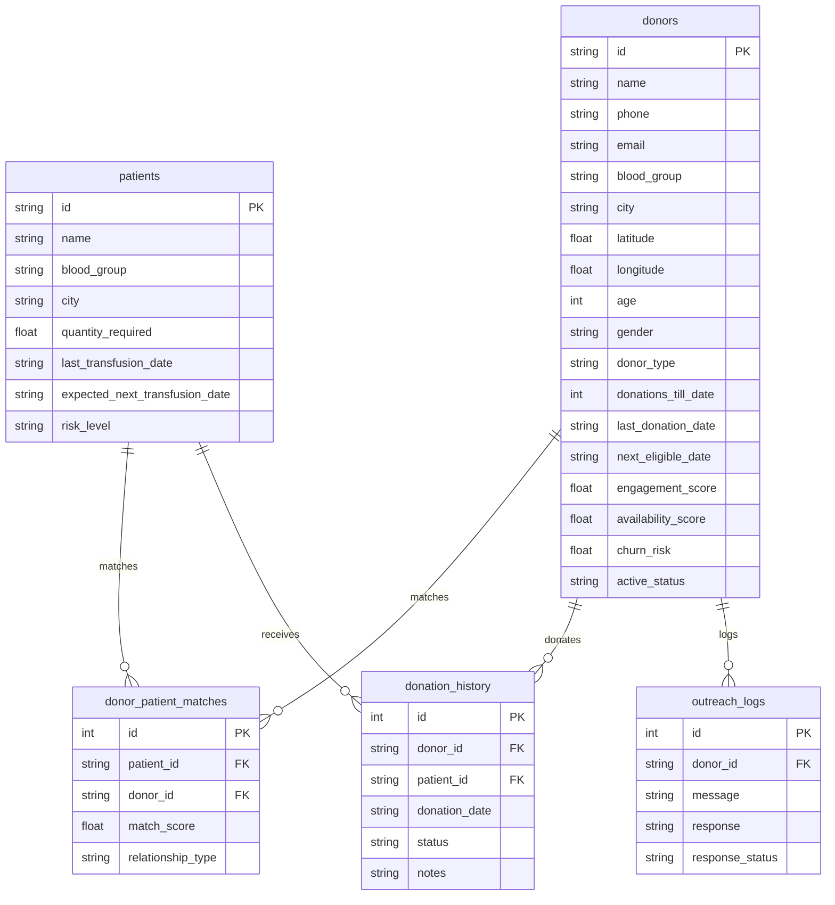
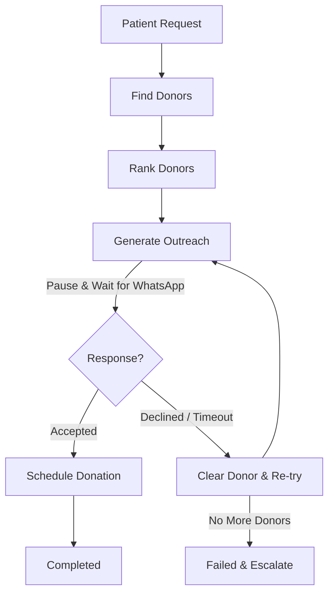

# Blood Warriors AI - System Architecture

Blood Warriors AI is a production-grade full-stack platform coordinating Thalassemia patient transfusions, blood donor availability predictions, and carrier screening awareness.

---

## 1. System Components

### Frontend (Next.js 15)
- **Framework**: Next.js 15 App Router with TypeScript.
- **Styling**: Tailwind CSS utilizing curated rose/crimson dark-mode tokens.
- **State Management**: Zustand lightweight global stores.
- **Charting**: Recharts responsive client-side forecasting graphs.

### Backend (FastAPI)
- **REST framework**: FastAPI with automated Swagger documentation.
- **ORM**: SQLAlchemy using async PG/SQLite connection pools.
- **Task Runner**: Built-in async triggers for ML pipelines and state transitions.

### AI Layer
- **Donor Availability**: XGBoost regressor predicting real-time donor readiness.
- **Donor Churn Risk**: RandomForest regressor modeling donor attrition probabilities.
- **Transfusion Orchestrator**: LangGraph compiled state machine implementing recursive matching and outreach retry queues.
- **Awareness Chatbot**: TF-IDF and Cosine Similarity-based vector store matching contexts for AWS Bedrock Claude queries.

---

## 2. Database Design

---

## 3. AI Smart Matching Engine

Matches are computed and ranked based on a weighted 40-20-20-10-10 composite formula:

$$Score = (Compatibility \times 0.40) + (Eligibility \times 0.20) + (Availability \times 0.20) + (Engagement \times 0.10) + (Distance \times 0.10)$$

1. **Compatibility (40%)**: Strict ABO-Rh compatibility checks (incompatible donors filtered out).
2. **Eligibility (20%)**: Verification that current date is past the donor's `next_eligible_date` window.
3. **Availability (20%)**: Predicted probability from the XGBoost availability model.
4. **Engagement (10%)**: Normalized donor historical participation rating.
5. **Distance (10%)**: Haversine distance calculation mapped to a score between 0.0 (50km+) and 1.0 (0km).

---

## 4. LangGraph Transfusion Orchestration

The transfusion coordination cycle is automated via a state machine that handles pauses for donor actions:

1. **Patient Request**: Validates request parameters and registers workflow.
2. **Find Donors**: Queries active compatible pool.
3. **Rank Donors**: Scores list using the Smart Matching composite scoring.
4. **Generate Outreach**: Selects top candidate and sends WhatsApp notification, pausing graph execution.
5. **Process Response**: Receives response. If accept, transitions to schedule. If decline, clears state and loops back to outreach next candidate.
6. **Schedule Donation**: Records appointment and updates donor eligibility calendars (+90 days).
