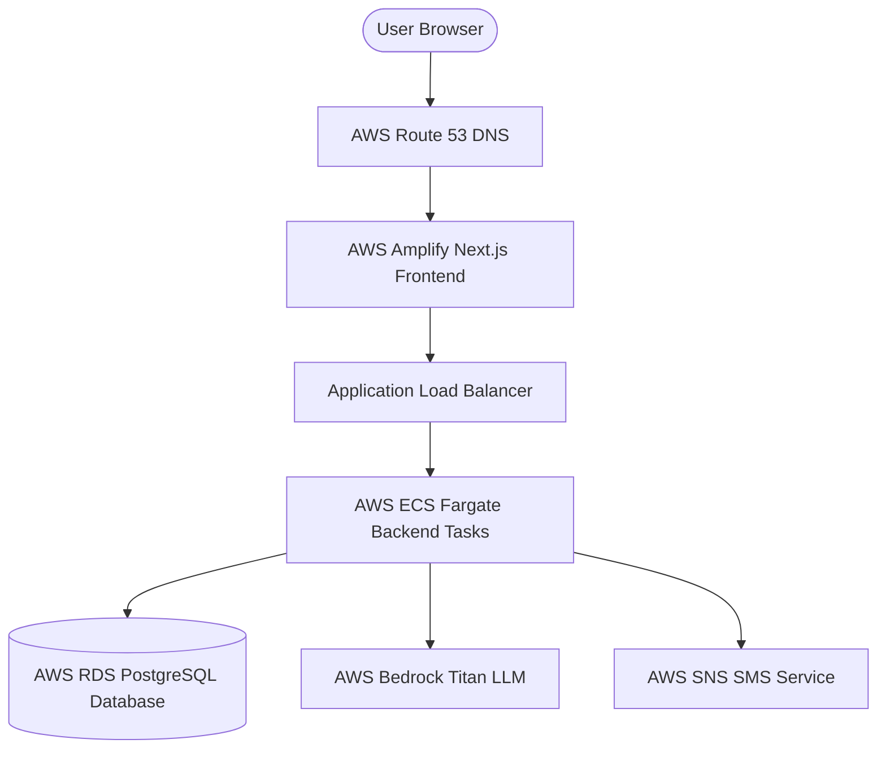

# Production Deployment Guide: AWS ECS Fargate & RDS

This guide details the step-by-step process of deploying the **Blood Warriors AI** application (FastAPI backend + Next.js frontend) to production on AWS.

---

## 1. Cloud Architecture Overview

The recommended production architecture utilizes serverless, highly-available AWS managed services:



- **Frontend**: Hosted on **AWS Amplify** (fully managed Next.js hosting) or **AWS S3 + CloudFront** (if static export is used).
- **Backend API**: Hosted on **AWS ECS Fargate** (serverless containers) under an **Application Load Balancer (ALB)**.
- **Database**: **AWS RDS PostgreSQL** (Multi-AZ enabled for automatic failover).
- **Security**: **AWS IAM Roles** assigned to Fargate tasks, preventing any hardcoded AWS keys in the codebase.
- **Messaging & AI**: **AWS SNS** for automated SMS outreach logs and **AWS Bedrock** for Thalassemia Care Copilot chats.

---

## 2. Setting Up AWS RDS (PostgreSQL)

1. Navigate to the **AWS RDS Console** and click **Create Database**.
2. Select **Standard create** and choose **PostgreSQL**. Select Engine Version **15** or **16**.
3. Choose **Production** or **Dev/Test** template depending on your budget:
   - For Production: Enable **Multi-AZ DB cluster** for high availability.
4. Set DB instance identifier to `blood-warriors-db`.
5. Enter master username (e.g., `postgres`) and configure a secure password.
6. Choose the DB instance class (e.g., `db.t4g.micro` or `db.m6g.large` depending on load).
7. Under **Connectivity**:
   - Select your **VPC** (recommend deploying inside private subnets).
   - Set **Public access** to **No**.
   - Create a new security group `blood-warriors-rds-sg` allowing inbound PostgreSQL traffic (`5432`) only from the ECS task security group.
8. Under **Additional configuration**, name the initial database `blood_warriors`.

---

## 3. Creating IAM Policies & Roles

To adhere to the principle of least privilege, do not embed AWS access keys inside container environment variables. Instead, use an **ECS Task Role**.

### Step 3.1: Create IAM Policy for SNS and Bedrock
Create a customer-managed policy named `BloodWarriorsExecutionPolicy` with the following permissions:

```json
{
    "Version": "2012-10-17",
    "Statement": [
        {
            "Sid": "SNSPublishSMS",
            "Effect": "Allow",
            "Action": [
                "sns:Publish"
            ],
            "Resource": "*"
        },
        {
            "Sid": "BedrockInvokeTitan",
            "Effect": "Allow",
            "Action": [
                "bedrock:InvokeModel"
            ],
            "Resource": "arn:aws:bedrock:*:*:model/amazon.titan-text-express-v1"
        }
    ]
}
```

### Step 3.2: Create ECS Task Role
1. Create an IAM Role named `BloodWarriorsTaskRole`.
2. Set the trusted relationship relationship entity to `ecs-tasks.amazonaws.com`.
3. Attach the `BloodWarriorsExecutionPolicy` to this role.
4. Attach standard execution role permissions to your **ECS Task Execution Role** (allows ECS to pull from ECR and log to CloudWatch).

---

## 4. Containerizing and Pushing to AWS ECR

1. Open the **AWS ECR Console** and create a repository named `blood-warriors-backend`.
2. Authenticate your local Docker daemon with ECR:
   ```bash
   aws ecr get-login-password --region <your-region> | docker login --username AWS --password-stdin <your-account-id>.dkr.ecr.<your-region>.amazonaws.com
   ```
3. Build the backend Docker image using the optimized Dockerfile:
   ```bash
   docker build -t blood-warriors-backend -f docker/backend.Dockerfile .
   ```
4. Tag and push the image to ECR:
   ```bash
   docker tag blood-warriors-backend:latest <your-account-id>.dkr.ecr.<your-region>.amazonaws.com/blood-warriors-backend:latest
   docker push <your-account-id>.dkr.ecr.<your-region>.amazonaws.com/blood-warriors-backend:latest
   ```

---

## 5. Deploying Backend on AWS ECS Fargate

### Step 5.1: Create ECS Cluster
1. Navigate to **AWS ECS** -> **Clusters** -> **Create Cluster**.
2. Name it `blood-warriors-cluster` and select **AWS Fargate (serverless)**.

### Step 5.2: Register Task Definition
Create a new Task Definition for `blood-warriors-backend`:
1. Launch type: **Fargate**.
2. Task Role: Select `BloodWarriorsTaskRole` (allows SNS/Bedrock).
3. Task Execution Role: Select standard execution role (allows ECR pull).
4. Define container settings:
   - **Image URI**: `<your-account-id>.dkr.ecr.<your-region>.amazonaws.com/blood-warriors-backend:latest`
   - **Port mappings**: `8000/HTTP`
5. Configure the following environment variables:
   - `DATABASE_URL`: `postgresql+asyncpg://<username>:<password>@<rds-endpoint>:5432/blood_warriors`
   - `SYNC_DATABASE_URL`: `postgresql+psycopg2://<username>:<password>@<rds-endpoint>:5432/blood_warriors`
   - `CORS_ORIGINS`: `https://app.yourdomain.com` (your frontend production domain)
   - `USE_LOCAL_MOCKS`: `FALSE` (enables live AWS SNS SMS and Bedrock LLM models)
   - `AWS_DEFAULT_REGION`: `<your-aws-region>`
   - `BEDROCK_MODEL_ID`: `amazon.titan-text-express-v1`

### Step 5.3: Create ALB and ECS Service
1. Create an **Application Load Balancer** (`blood-warriors-alb`) in public subnets with listeners on `HTTP (80)` and `HTTPS (443)` (configured with your SSL certificate from ACM).
2. Create an ECS Service under `blood-warriors-cluster` targeting the registered task definition.
3. Configure the service:
   - Desired tasks: `2` (for high availability and load distribution).
   - Deploy inside private subnets.
   - Attach to the Application Load Balancer and route target group traffic to container port `8000`.

---

## 6. Database Schema Initialization (One-Time Execution)

Because running db initializations and seeds on every server container startup is dangerous in a load-balanced multi-container system, you should execute database initialization as a **one-time ECS task** or a migration run:

Run a one-time Fargate Task with the following command override:
```bash
python -m app.db.init_db
```
This script will read the pre-packaged `Dataset.csv`, build PostgreSQL tables, ingest structural tables, and insert all seeded donor patient care bridges records. Subsequent backend container startups will recognize that the database is already populated and skip ingestion safely.

---

## 7. Deploying Frontend on AWS Amplify

AWS Amplify is the easiest and most robust solution for deploying Next.js applications:

1. Push your frontend codebase (e.g. from the `frontend` folder or monorepo) to GitHub, GitLab, or Bitbucket.
2. Go to the **AWS Amplify Console** and click **New app** -> **Host web app**.
3. Authenticate with your git provider and select the repo and branch.
4. Amplify will automatically detect Next.js settings. In build settings, specify the path to your frontend subdirectory:
   - Set **Monorepo folder path** to `frontend`.
5. Add Frontend environment variables in the console build settings:
   - `NEXT_PUBLIC_API_URL`: `https://api.yourdomain.com/api/v1` (pointing to your ALB domain address).
6. Click **Save and Deploy**. AWS Amplify will provision the build environment, build the production Next.js assets, host it globally via CloudFront CDN, and auto-renew SSL certificates.

---

## 8. Verification and Monitoring

- **Healthcheck**: Set ALB healthcheck path to `/` (returns JSON status online).
- **Logs**: Monitor backend API container stderr/stdout outputs inside **AWS CloudWatch Log Groups** under `/ecs/blood-warriors-backend`.
- **Database Connection**: Ensure the ECS task security group has inbound rules added to the RDS security group for port `5432`.
